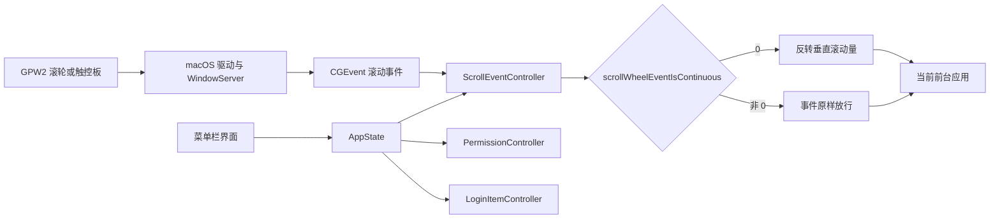

# 鼠标与触控板独立滚动方向应用方案

## 1. 方案状态

- 设计时间：2026-07-16 14:50，Asia/Shanghai。
- 设计状态：架构、数据流、权限、界面、异常处理和验收标准均已经用户逐项确认。
- 使用范围：仅供用户自己的 Mac 使用，不考虑 Mac App Store 发布。
- 目标设备：罗技 GPW2 鼠标和 Mac 内置触控板。
- 实际环境：Apple Silicon，macOS 26.3，Build 25D125。
- 当前工具链：Apple Swift 6.3.2 和 Command Line Tools 已安装；`/Applications/Xcode.app` 不存在。实现前必须由用户明确选择安装完整 Xcode，或批准命令行构建和打包路线；两条路线都不得跳过构建和签名验证。

## 2. 根本目标

macOS 的“自然滚动”会同时影响鼠标和触控板。用户需要在系统保持自然滚动开启时，让触控板继续自然滚动，同时将 GPW2 鼠标的垂直滚轮恢复为传统方向。

完成条件是：

- GPW2 垂直滚轮按传统方向工作。
- 触控板双指滚动和惯性滚动按自然方向工作。
- 两种设备可以随时交替使用，不修改系统设置，不等待状态切换。
- 暂停或退出应用后，系统输入立即恢复原始行为。

## 3. 需求边界

### 3.1 范围内

- 菜单栏常驻应用。
- 支持登录时启动。
- 只反转 GPW2 的垂直滚动。
- 显示已启用、已暂停或需要权限状态。
- 引导授予必要的系统权限。
- 在事件过滤器被系统禁用时恢复其运行。

### 3.2 范围外

- Magic Mouse 和第三方触控鼠标。
- 按硬件 VID/PID 管理多个设备。
- 滚动速度、加速度和步长调节。
- 水平滚动反转。
- 鼠标按键映射、指针速度和触控板其他手势。
- 动态修改 macOS “自然滚动”设置。
- 驱动、内核扩展、后台守护进程和私有 API。
- Mac App Store 上架。

## 4. 问题诊断与支撑数据

### 4.1 根因

鼠标和触控板没有独立的系统滚动方向开关。直接切换系统设置会改变全局状态，无法在两种设备交替输入时稳定工作。

### 4.2 已验证的 API 事实

- Core Graphics 的主动 `CGEventTap` 可以修改低层输入事件。
- `scrollWheelEventIsContinuous` 字段表示滚动数据是像素级连续数据还是行级离散数据。
- `CGEventTapEnable` 可在事件过滤器因超时或用户输入被禁用后重新启用。
- macOS 13 及以上可使用 `SMAppService.mainApp` 管理主应用登录启动。
- 成熟开源实现 Scroll Reverser 使用事件过滤器、连续滚动标记和手势状态区分鼠标与触控板，证明了总体技术路线可行。

### 4.3 必须实测的硬件事实

Apple 公开 API 给出的是滚动特征，不是绝对物理设备身份。因此必须在用户实际设备上验证：

- GPW2 滚轮事件的 `scrollWheelEventIsContinuous` 实测值为 `0`。
- Mac 触控板滚动事件的实测值非 `0`。

这两项是当前分类方案的验收门槛。若不成立，必须停止当前实现路线并重新提交双指手势状态识别方案，不得宣称已完成。

## 5. KISS 决策

1. 这是真实问题：系统共用滚动方向设置与用户的两类输入硬件需求直接冲突。
2. 更简单的做法：只监听滚动事件，通过公开的连续标记分类，不枚举硬件，不切换系统设置。
3. 不破坏原有功能：只修改判定为 GPW2 的垂直滚动量，其余事件原样返回。
4. 当前确实需要：所有保留的组件都直接服务于滚动方向、授权、常驻和恢复。

## 6. 架构与完整调用链



### 6.1 用户操作链

菜单栏开关 -> `AppState` 更新 -> 检查权限 -> 启动或停止 `ScrollEventController` -> 更新菜单状态。

### 6.2 输入事件链

HID 设备 -> macOS 驱动 -> WindowServer -> `CGEventTap` -> 来源分类 -> 垂直数值变换或原样放行 -> 前台应用。

### 6.3 登录启动链

macOS 用户登录 -> `SMAppService` 启动主应用 -> 恢复用户的启用状态 -> 复查权限 -> 创建事件过滤器。

### 6.4 错误传播链

权限缺失或过滤器创建失败 -> `ScrollEventController` 不进入启用状态 -> `AppState` 显示真实原因 -> 菜单提供对应系统设置入口。

## 7. 组件设计

### 7.1 应用入口与菜单栏

- 以菜单栏形式运行，不显示 Dock 图标。
- 不创建常规设置窗口。
- 仅显示状态、启用开关、登录启动开关、权限入口和退出命令。

### 7.2 `AppState`

- 作为界面状态的单一来源。
- 保存用户的启用选择。
- 读取登录项的真实系统状态，不使用重复布尔值伪造状态。
- 协调权限检查、事件过滤器和菜单反馈。

### 7.3 `PermissionController`

- 检查和请求辅助功能权限。
- 检查和请求输入监控权限。
- 用户主动点击启用时才触发系统授权流程。
- 在应用重新成为活动应用或用户点击重新检查时刷新权限，不常驻高频轮询。

### 7.4 `ScrollEventController`

- 只创建一个面向滚动事件的主动 `CGEventTap`。
- 管理 Mach port、RunLoop source 及其释放。
- 事件回调只做字段读取、条件判断和数值变换。
- 收到超时或用户输入禁用事件时，调用 `CGEventTapEnable` 恢复过滤器。
- 停止时完整移除 RunLoop source，使 Mach port 失效并释放对象。

### 7.5 来源分类与数值变换

分类规则保持为纯逻辑：

```text
continuous == 0     -> GPW2 鼠标滚轮
continuous != 0     -> Mac 触控板
```

对鼠标事件同步反转公开的垂直滚动字段：

- `scrollWheelEventDeltaAxis1`
- `scrollWheelEventFixedPtDeltaAxis1`
- `scrollWheelEventPointDeltaAxis1`

水平字段、时间戳、标志位、事件来源及其他数据原样保留。触控板事件不做任何写入。

### 7.6 `LoginItemController`

- 使用 `SMAppService.mainApp` 注册或取消注册主应用。
- 菜单开关显示 `SMAppService` 报告的真实状态。
- 首次授权和启用成功后默认注册登录启动，用户可以从菜单关闭。

## 8. 权限设计

应用只在用户点击“启用鼠标反向滚动”后请求权限。

1. 使用 `AXIsProcessTrustedWithOptions` 检查和引导授予辅助功能权限。
2. 使用 `CGPreflightListenEventAccess` 检查输入监控权限，缺失时由 `CGRequestListenEventAccess` 发起请求。
3. 两项检查通过后才创建事件过滤器。
4. 若 macOS 要求重新启动应用，菜单显示真实状态和操作指引，不循环触发授权框。
5. 应用完成后放置在 `/Applications`，并保持固定 bundle identifier 和稳定代码签名，避免 TCC 将新构建识别为其他应用。

## 9. 界面与状态

菜单项仅包含：

- 状态：已启用、已暂停或需要权限。
- “启用鼠标反向滚动”开关。
- “登录时启动”开关。
- 权限缺失时显示的“打开隐私与安全设置”。
- “退出”。

状态转换规则：

- 启用且权限完整且过滤器成功运行 -> 已启用。
- 用户关闭功能 -> 已暂停。
- 用户希望启用但权限不完整 -> 需要权限。
- 过滤器创建或恢复失败 -> 显示失败原因，不标记已启用。

## 10. 异常处理

| 情况 | 检测方式 | 系统行为 | 用户反馈 |
| --- | --- | --- | --- |
| 辅助功能权限缺失 | 公开权限检查 | 不创建过滤器 | 显示需要权限和系统设置入口 |
| 输入监控权限缺失 | 公开权限检查 | 不创建过滤器 | 显示需要权限和系统设置入口 |
| `CGEventTap` 创建失败 | 创建结果为空 | 保持系统原始滚动 | 显示失败，提供重新检查 |
| 过滤器因超时被禁用 | 回调收到对应事件 | 立即重新启用 | 只有恢复失败时显示错误 |
| 过滤器因用户输入被禁用 | 回调收到对应事件 | 立即重新启用 | 只有恢复失败时显示错误 |
| 登录项注册被拒绝 | `SMAppService` 返回状态或错误 | 当前运行不受影响 | 登录开关显示真实未启用状态 |
| 用户暂停或退出 | 明确的用户操作 | 释放过滤器和运行循环源 | 系统原始滚动立即恢复 |

## 11. 性能影响评估

- 事件掩码只包含滚动事件，不监听高频鼠标移动事件。
- 每个回调只执行常数次字段读取、比较和乘以 `-1`。
- 回调不记录文件、不执行网络请求、不刷新界面、不同步等待其他线程。
- 暂停时完全销毁过滤器，而不是对所有事件做空判断。
- 不预设 CPU、内存或延迟数字。完成前使用实际设备测量并如实记录结果。

## 12. 风险与缓解

| 风险 | 影响 | 缓解措施 |
| --- | --- | --- |
| GPW2 被驱动或 G HUB 转换为连续滚动 | 与触控板分类失败 | 真实设备数据为硬性验收门槛；不通过则停止并重新设计 |
| macOS 权限被撤销 | 过滤器不再工作 | 应用激活和用户请求时重新检查，界面显示真实状态 |
| 事件回调超时 | 系统禁用过滤器 | 回调保持常数时间操作，收到禁用事件后重新启用 |
| 部分应用使用自定义手势而非滚动事件 | 该应用中无法反转 | 本轮只验收 Finder、Safari、终端、系统设置和标准长文档界面；其他自定义手势不扩大范围 |
| 应用路径、bundle identifier 或签名变化 | TCC 权限失效 | 固定安装路径、bundle identifier 和签名 |
| 当前 Mac 没有完整 Xcode | 无法按标准原生应用工作流构建和签名 | 实现前先安装并验证 Xcode，或由用户另行批准命令行打包路线 |

## 13. 测试与验收

### 13.1 纯逻辑测试

- `continuous == 0` 时垂直三类滚动值全部取反。
- `continuous != 0` 时事件所有字段不变。
- 垂直滚动值为零时保持零。
- 水平滚动字段始终不变。

### 13.2 组件测试

- 权限不完整时不创建过滤器。
- 启用、暂停和退出时资源生命周期完整。
- 过滤器禁用事件能够触发恢复。
- 用户的启用选择在重启后恢复。
- 登录项开关与 `SMAppService` 真实状态一致。

### 13.3 真实设备测试

- 在 GPW2 上记录并核对连续滚动标记。
- 在 Mac 触控板上记录并核对连续滚动标记。
- 在 Finder、Safari、终端、系统设置和标准长文档界面验证方向。
- 快速交替使用 GPW2 和触控板。
- 验证触控板手指离开后的惯性滚动。
- 断开并重连 LIGHTSPEED 接收器。
- 执行睡眠唤醒、锁屏解锁和重新登录。
- 撤销权限并验证应用真实报告状态。
- 暂停和退出应用，验证系统原始滚动立即恢复。

### 13.4 性能验证

- 在空闲、持续鼠标滚动和持续触控板滚动三种状态下测量 CPU 和内存。
- 检查事件过滤器是否因回调延迟被系统禁用。
- 如实报告测量值、测试时的系统版本和硬件状态。

## 14. 文件影响评估

当前阶段只新增本方案文件和 Git 元数据，不创建应用代码、测试文件、配置文件或 README。

后续实施将仅包含以下功能模块，实际文件路径由经用户批准的实施计划统一确定：

- 应用入口和菜单栏界面。
- `AppState`。
- `PermissionController`。
- `ScrollEventController` 及来源分类逻辑。
- `LoginItemController`。
- 与分类、数值变换、状态转换和资源释放相关的测试。
- 原生 macOS 应用必需的工程和签名配置。

## 15. 实施前置门槛

1. 用户审阅并确认本方案文件。
2. 用户在完整 Xcode 安装与命令行打包两条路线中明确选择一条。
3. 根据已确认方案编写实施计划，并在任何应用代码修改前获得用户批准。
4. 功能开发在 `feature/scroll-direction-app` 分支进行。
5. 提交前执行代码审查和相关验证。
6. GitHub 远程仓库的名称和可见性必须由用户明确选择，不默认公开。

## 16. 参考资料

- [Apple: CGEventTapOptions](https://developer.apple.com/documentation/coregraphics/cgeventtapoptions)
- [Apple: scrollWheelEventIsContinuous](https://developer.apple.com/documentation/coregraphics/cgeventfield/scrollwheeleventiscontinuous)
- [Apple: CGEventTapEnable](https://developer.apple.com/documentation/coregraphics/cgevent/tapenable%28tap%3Aenable%3A%29)
- [Apple: AXIsProcessTrustedWithOptions](https://developer.apple.com/documentation/applicationservices/1459186-axisprocesstrustedwithoptions)
- [Apple: SMAppService](https://developer.apple.com/documentation/servicemanagement/smappservice)
- [Scroll Reverser 开源实现](https://github.com/pilotmoon/scroll-reverser)
