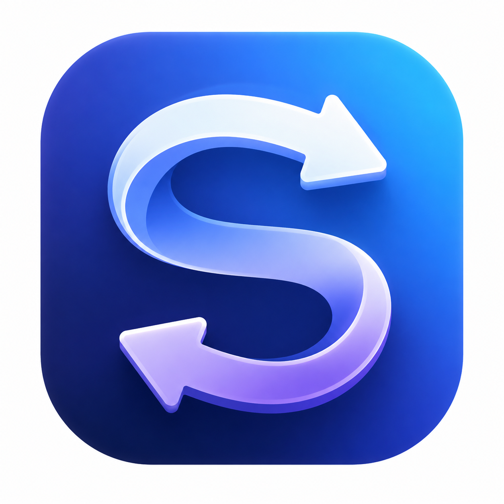

# ScrollDirection

ScrollDirection 是一个仅驻留在 macOS 菜单栏的个人工具。它在系统“自然滚动”保持开启时，只反转外接鼠标的垂直滚动方向，同时保持内置触控板的自然滚动、惯性滚动和全部水平滚动行为不变。

## 业务规则

- 系统“自然滚动”保持开启。
- 鼠标垂直滚动的 Axis 1 数值乘以 `-1`。
- 触控板垂直滚动和惯性滚动保持原值。
- Axis 2 水平滚动字段不修改。
- 功能暂停或应用退出后，系统立即恢复原始滚动行为。
- 应用不按设备名称或型号硬编码逻辑，GPW2 只是真实设备验收对象。

## 技术基线

- macOS 26.0 及以上。
- Xcode 工程：`ScrollDirection.xcodeproj`。
- Swift 6，SwiftUI 菜单栏界面，AppKit 与 Core Graphics 负责事件读取。
- Bundle Identifier：`com.weiyu1218.ScrollDirection`。
- `SMAppService.mainApp` 管理登录时启动。
- 当前分发范围为本人使用，应用使用本机 Apple Development 身份签名。

## 架构

| 文件 | 职责 |
| --- | --- |
| `ScrollDirectionApp.swift` | 创建唯一的 `AppState`，启动应用，并提供 `MenuBarExtra`。 |
| `MenuBarView.swift` | 显示运行状态、功能开关、登录项开关、权限入口和退出操作。 |
| `AppState.swift` | 协调用户偏好、权限、事件过滤器、登录项和可见状态。 |
| `PermissionController.swift` | 查询并请求辅助功能与输入监控权限。 |
| `LoginItemController.swift` | 映射 `SMAppService` 状态并执行注册或注销。 |
| `ScrollEventController.swift` | 建立手势监听与滚轮过滤两个事件 tap，管理生命周期并处理事件。 |
| `ScrollSource.swift` | 根据双指手势、滚动阶段和惯性阶段判定来源。 |
| `VerticalScrollDelta.swift` | 读取、反转并写回三个 Axis 1 垂直滚动字段。 |

## 事件数据流

1. `ScrollDirectionApp` 在主 actor 上创建 `AppState`。
2. `AppState` 检查用户开关和两项系统权限，只有条件满足时才启动 `ScrollEventController`。
3. 只读手势 event tap 接收 `.gesture` 事件，通过 `NSEvent` 读取当前 touching 数量并更新 `ScrollSourceClassifier`。
4. 可修改的滚轮 event tap 接收 `.scrollWheel` 事件，结合当前手势证据、`phase` 和 `momentumPhase` 判定来源。
5. 来源为 `trackpad` 时原样返回事件；来源为 `mouse` 时，`VerticalScrollDelta` 只反转 Axis 1 的 line、fixed-point 和 point 三种表示。
6. 原事件继续由系统分发，不创建或注入新的滚动事件。

## 滚动来源判定

GPW2 与内置触控板的 `scrollWheelEventIsContinuous` 实测值都为 `0`，因此该字段不参与来源判定。

`ScrollSourceClassifier` 使用以下单一实现：

- 至少两个 touching 点建立触控板证据。
- 手势证据与滚动事件的关联窗口为 222 毫秒。
- 非空 `phase` 直接表示触控板滚动。
- 非空 `momentumPhase` 只在上一来源为触控板时延续为触控板惯性。
- 不满足上述条件的滚动判定为鼠标。
- 手势结束、取消、超时或过滤器停止时清理对应状态。

## 状态与权限

`AppState` 是界面状态的唯一所有者，并在主 actor 上运行。状态只取以下四类：

- `enabled`：两项权限齐全，两个事件 tap 均已启用。
- `paused`：用户关闭鼠标反向滚动。
- `permissionRequired`：辅助功能或输入监控权限缺失。
- `failed`：事件 tap 创建、连接或运行状态验证失败。

登录项错误独立显示，不会关闭已经正常运行的滚动过滤器。事件 tap 被系统暂时禁用时，对应回调只重新启用原 tap。

## 代码约束

- 不使用私有 API、IOHID 设备枚举或设备型号白名单。
- 不使用 `CGEventPost` 重新注入事件。
- 事件回调中不执行文件 I/O、日志、等待或界面更新。
- 停止过滤器时必须同时移除两个 run-loop source、失效两个 event tap，并清空来源状态。
- 新增滚动逻辑必须同时覆盖鼠标、触控板、惯性滚动和水平字段不变的测试。
- 功能保持单一实现，不并行维护按版本命名的分类器。

## 验证结构

`ScrollDirectionTests` 使用 Swift Testing，覆盖垂直数值变换、来源状态机、事件过滤器资源释放、权限组合、登录项状态映射和应用状态协调。发布前验证以 Swift 6 严格并发测试、Release 构建、代码签名检查，以及 GPW2 与内置触控板真实操作结果为准。
